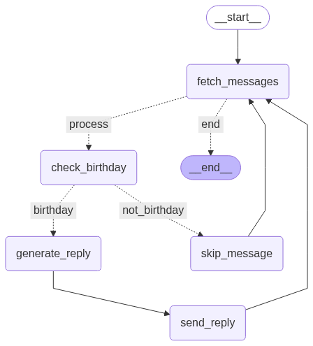

# Auto Insta-HBD Replier
Just like you (probably...), I am a college student with numerous friends and colleagues. Every year, I used to undergo this ritual of replying everyone with a "Thank You❤️✨". Well... you come up with such ideas when you realise your life is monotonous enough to add such a ritual to this tiny but special day of your life.

## What is it?
> An AI Agent that automates the process of fetching, analyzing and crafting the best reply to the sweet birthday wishes of your closest friends and family members!!!

## Credit goes to...
1. **BACKBONE**: Langgraph Agent
2. Instagrapi
3. Google Gemini (Free APIs!)

## How does it work?

The system uses a **LangGraph Agent** that orchestrates the entire workflow through a state machine with the following nodes:



### 🔄 **Agent Workflow**

1. **Fetch Messages** ([`fetch_messages`](src/agent.py))
   - Connects to Instagram using [`InstagramClient`](src/instagram.py)
   - Retrieves unread direct messages from the target date
   - Filters out already processed messages and empty text messages

2. **Birthday Detection** ([`check_birthday_message`](src/agent.py))
   - Uses Google Gemini LLM to analyze message content
   - Identifies birthday-related keywords: "birthday", "happy birthday", "bday", "celebrate", "wishes", "many more"

3. **Smart Routing**
   - **Birthday Message** → Generate personalized reply
   - **Non-Birthday Message** → Skip and mark as processed

4. **Reply Generation** ([`generate_birthday_reply`](src/agent.py))
   - Leverages [`llm`](src/llm.py) (Google Gemini 2.0 Flash) to craft responses
   - Creates warm, genuine, and personalized replies
   - Matches the tone of the original message
   - Keeps responses concise (1-2 sentences)

5. **Send Reply** ([`send_reply`](src/agent.py))
   - Automatically sends the generated reply via Instagram DM
   - Marks user as processed to avoid duplicate responses
   - Continues to next message in queue


## Try it yourself
1. Installation of the necessary libraries
```bash
pip install -r requirements.txt
```
2. Environment Variables:
> Rename .env.example -> .env<br>

Fill the .env in the following format:
```
TARGET_DATE=yyyy-mm-dd
INSTAGRAM_USERNAME=your_username
INSTAGRAM_PASSWORD=your_password
GOOGLE_API_KEY=your_gemini_api_key
```
3. Open your favorite terminal (make sure you are int the root of the project) and run:
```bash
python main.py
```
